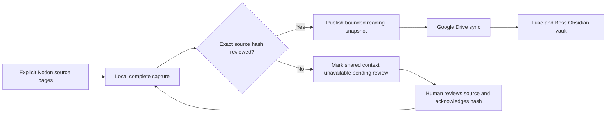

# Self-updating context on the work Mac

The shared vault is a collaboration space for Luke and Boss. The publisher's
local connector refreshes selected Notion context on a schedule and publishes
reviewed reading snapshots to Drive. Both Macs receive ordinary Markdown through
Drive for desktop. The schedule never starts Claude/Cursor, spends model tokens,
changes a requirement, approves changed content, or publishes an outcome to Notion.

Finance Git storage in Drive has its own explicit work transfer procedure.
This refresh job does not fetch, pull, push, merge or synchronize Git internals.
After deliberately updating the local checkout, refresh the packet before the
next model stage; business/task changes can invalidate an existing route.
See [FINANCE_GIT.md](FINANCE_GIT.md).

## The update loop



The default proposed interval is **five minutes**, shorter than the default
15-minute freshness limit. The job runs only when the publisher Mac is available;
sleep, logout, network failure and Drive delay can postpone updates. It is not a
five-minute delivery guarantee. The shared pointer records observation and expiry
times, and `shared-status` validates the locally received snapshot's hashes.

An unchanged source remains reviewed. A changed source requires a new local
acknowledgment even when someone has already changed its Notion Approved field.
An automatic process must not approve its own new input. This is the main cost
tradeoff: cheap deterministic refreshes, with explicit human review at business
changes instead of repeated model discovery.

## First manual refresh

Initialize the shared layout as described in [SHARED_VAULT.md](SHARED_VAULT.md).
Configure the exact Notion page IDs and read credential on the publisher Mac.
Commands run from the portable kit folder; `wc_config` is a LOCAL config path.

```bash
wc_config="$HOME/Work/ExecutionWorkspace/10 Projects/forecast-automation/context/config.json"
python3 work-context.py --config "$wc_config" refresh --task TASK-001
python3 work-context.py --config "$wc_config" approve-source --reviewed-hash '<source_hash>' --actor '<reviewer-name>'
python3 work-context.py --config "$wc_config" refresh --task TASK-001
python3 work-context.py --config "$wc_config" shared-status
```

Inspect the captured source before acknowledging its hash. The first refresh can
produce a fresh local candidate while shared context remains unavailable pending
review. The second publishes the reviewed business reading copy. Executable task
packets and technical scope remain in the local workspace. A reader member can
refresh its own local context but cannot publish over the designated publisher.

Use one scheduled task per published project: the shared reading pointer is
project-wide and reflects that selected task's business requirements. For another
task, deliberately change the schedule's task selection and review the selected
source boundary. Do not run competing task schedules against one project mirror.

## Credentials for background refresh

A LaunchAgent does not inherit the `export NOTION_READ_TOKEN=...` from your open
Terminal. Provision credentials through your company's approved mechanism.
The bridge supports either an already supplied process environment variable or
an existing macOS Keychain generic-password item:

```bash
python3 work-context.py --config "$wc_config" refresh --task TASK-001 --keychain-service 'EnterpriseConnector.NotionRead' --keychain-account '<work-account-label>'
```

The service/account strings identify an item; they are not token values. Create
or provision that item through the approved work credential process. The kit does
not create Keychain entries or change their access controls. At runtime it reads
using `/usr/bin/security find-generic-password`, captures the value in memory and
never puts it in a plist, vault, command argument, log or JSON result. An existing
process token takes precedence. Locked/unavailable Keychain access stops capture
and invalidates previous current context; it never silently uses cached access.

## Export a reviewed LaunchAgent

The command below creates an offline plan. `--python` can name your approved
absolute Python 3.11+ executable; by default it uses the current interpreter.
Keep the portable kit itself outside the shared vault.

```bash
python3 work-context.py --config "$wc_config" refresh-schedule --task TASK-001 --interval 300 --keychain-service 'EnterpriseConnector.NotionRead' --keychain-account '<work-account-label>'
```

Inspect the Python executable, kit/config paths, task, interval and credential
reference. Then repeat the same arguments with the returned hash:

```bash
python3 work-context.py --config "$wc_config" refresh-schedule --task TASK-001 --interval 300 --keychain-service 'EnterpriseConnector.NotionRead' --keychain-account '<work-account-label>' --apply --reviewed-hash '<reviewed_operation_hash>'
```

This exports a `.plist` to the profile's private `launchd` directory. It does
**not install or start the schedule**. After reviewing it on the work Mac, use
the exact `plist_path` and `label` returned:

```bash
wc_plist='<absolute-plist_path>'
wc_label='<returned-label>'
mkdir -p "$HOME/Library/LaunchAgents"
cp "$wc_plist" "$HOME/Library/LaunchAgents/$wc_label.plist"
launchctl bootstrap "gui/$(id -u)" "$HOME/Library/LaunchAgents/$wc_label.plist"
launchctl kickstart "gui/$(id -u)/$wc_label"
```

The plist uses separate ProgramArguments, so spaces in paths remain literal.
It includes no token or shell expansion. LaunchAgent locations and timed
StartInterval jobs follow [Apple's launchd guidance](https://developer.apple.com/library/archive/documentation/MacOSX/Conceptual/BPSystemStartup/Chapters/CreatingLaunchdJobs.html).

To stop it before a handover or update:

```bash
launchctl bootout "gui/$(id -u)/$wc_label"
launchctl disable "gui/$(id -u)/$wc_label"
```

Remove its specific plist through Finder if retiring the schedule. To restart a
previously disabled label, run `launchctl enable "gui/$(id -u)/$wc_label"` before
bootstrap. Do not leave a schedule installed on the old publisher after handover.

## Health, conflicts and retention

Inspect the private `refresh-health.json` in the state directory for the latest
outcome, and `context/CURRENT_STATE.md` for local packet health. The schedule
discards console output to avoid an ever-growing source-content log; diagnostics
are overwritten as a small current-state record. If config itself cannot load,
run the exact ProgramArguments manually and use `launchctl print` for launch
errors. Commands still return nonzero exit status on failure.

The project lock serializes commands on one Mac. It is not a lock across Drive
clients. Publisher handover requires stopping the old job, letting Drive sync,
changing the publisher epoch, and rebinding the new publisher. Review the detailed
handover and conflict procedure in [the shared-vault guide](SHARED_VAULT.md).

Source access loss, disallowed classification, policy changes or failed complete
captures invalidate shared reading context. Generated snapshots are quarantined
into private state; human notes are preserved. Failed removal leaves a durable
pending operation and blocks a new publication until resolved. Offline replicas
and material already copied into other applications cannot be remotely erased.
Use work retention and backup policies for private quarantine; Drive sync is not
an independent backup.

## Updating connector code

Content refresh and code upgrades are separate operations. This job does not
run git pull, pip install, curl-to-shell or self-modify its compiler. For a code
upgrade, stop the job, download/review a new release, verify its checksum and
self-test, and regenerate the schedule so it points to the new kit. Preserve the
work config and state journals. Restart, refresh, and verify the new shared
snapshot. The repository's review process governs software changes.
